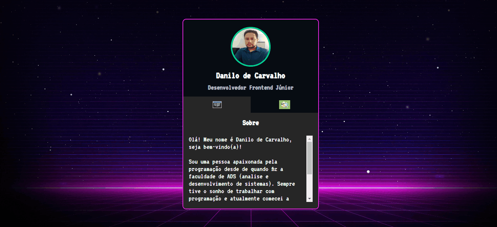

<h1 align="center">
    <p>Projeto Mini-Portfólio</p>
</h1>

<h1>
    
</h1>

<h3 align="center">
    <a href="https://danilo-de-carvalho88.github.io/mini-portifolio/" target="_blank">Acessar a demonstração</a>
</h3>

# 📑 Índice
- [Sobre](#-sobre)
- [Tecnologias utilizadas](#-tecnologias-utilizadas)
- [Como baixar o projeto](#-como-baixar-o-projeto)

---

## 📖 Sobre
O projeto "Mini-Portfólio" foi criado para demonstrar as funcionalidades da integração do HTML, CSS e JS na construção de um portfólio de apresentação para o mercado de trabalho.

---

## 💻 Tecnologias utilizadas
- HTML
- CSS
- JS

---

## 💽 Como baixar o projeto
1 - Clonar o repositório.

```bash
    $ git clone https://github.com/Danilo-de-Carvalho88/mini-portifolio.git
```

2 - Entrar no diretório.

```bash
    $ cd menu-bank 
```

3 - Instalar as dependências.

```bash
    $ yarn install 
```

4 - Iniciar o projeto.

```bash
    $ yarn start
```

Desenvolvido por Danilo de Carvalho 😎

